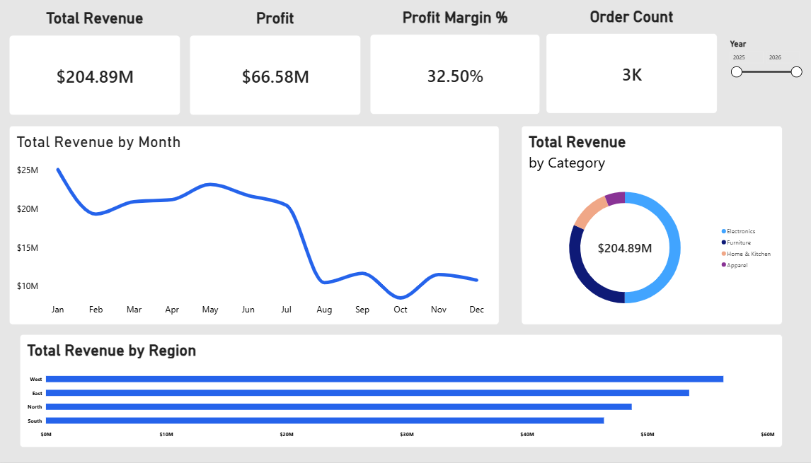

# Sales & Revenue Analysis Dashboard

## 📊 Project Overview

This project is an interactive **Sales & Revenue Analysis Dashboard** built using **Microsoft Power BI**. The dashboard helps analyze overall business performance through key metrics and visual insights.

## 🚀 Dashboard Preview

> The image above shows the final Power BI dashboard.

## 📈 Key Performance Indicators

- **Total Revenue:** $204.89M
- **Profit:** $66.58M
- **Profit Margin:** 32.50%
- **Order Count:** 3K

## 📊 Dashboard Features

### 1. Revenue Trend Analysis
Visualizes **Total Revenue by Month**, helping identify monthly sales patterns and trends.

### 2. Category Analysis
Displays **Total Revenue by Category** using a donut chart.

### 3. Regional Analysis
Compares **Total Revenue across different regions** using a horizontal bar chart.

### 4. Interactive Filtering
Includes a **Year slicer** to filter and analyze dashboard data for different years.

## 🛠️ Tools & Technologies Used

- Microsoft Power BI
- DAX
- Power Query
- Data Visualization

## 📁 Repository Contents

- `Sales_Revenue_Analysis_Dashboard.pbix` – Power BI dashboard file
- `dashboard.png` – Dashboard screenshot
- `README.md` – Project documentation

## 🎯 Key Insights

The dashboard provides a consolidated view of:

- Overall revenue and profitability
- Monthly revenue trends
- Revenue distribution across product categories
- Regional revenue performance
- Year-wise interactive analysis

---

**Developed as a Sales & Revenue Analysis Dashboard project using Microsoft Power BI.**
